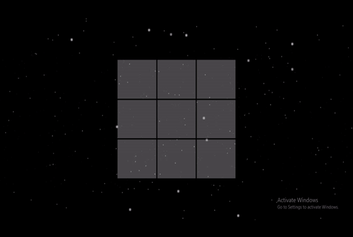

<h3 align="center">Tic Tac Toe</h3>

---

## 🧐 About 

A Tic Tac Toe game having 3D galaxy background. Basically game containes two players one's human player and another is AI player.

AI player plays the game optimally against human player and tries to maximize it's score.

The minimax algorithm is used in this project for Artificial Intelligence.

### Requirements

- Basic knowledge of [p5.js](https://p5js.org/)
- Basic understanding of [Minimax algorithm](https://www.geeksforgeeks.org/minimax-algorithm-in-game-theory-set-1-introduction/)

## ⛏️ Built Using 

- HTML5
- CSS3
- JavaScript
- P5.js
